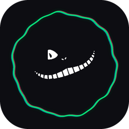

<div align="center">



# Zero-Bloat Sound

**Аудио- и видео-плеер в духе Winamp — дух, а не косплей.**
Простота, скины и функционал без раздувания. Каждая фича выключается в настройках.


</div>

---

> **Статус: pre-release, активная разработка.** Играет, индексирует, кастует, носит скины — но до v1.0 ещё дорога.
> Живое демо интерфейса: **[denisgolub.ru/zbs](https://denisgolub.ru/zbs)**

## Возможности

**Плейбек** — BASS-движок, gapless/кроссфейд, мягкая пауза, скорость с сохранением тона, A-B повтор,
умный шаффл, CUE-листы, резюме длинных файлов, ReplayGain + автогромкость тихих треков, медиа-клавиши,
трей, сон-таймер.

**Медиатека** — SQLite, инкрементальный скан, **дерево Артист → Альбом** и живой поиск (по названию,
артисту, альбому, папке). Теги достраиваются из имён файлов и структуры папок. Обложки (тег → папка →
Cover Art Archive), рейтинги, поиск дубликатов, сканер битых, все форматы плейлистов.

**Сеть и вещание** — интернет-радио с каталогом и «сейчас в эфире», «частотный» FM-тюнер, подкасты с
офлайн-загрузкой, запись эфира в MP3, **веб-пульт** для управления с телефона.

**Каст** — трансляция на телевизор/колонку по DLNA.

**Видео** — libmpv, клипы в общем плейлисте с музыкой; свернул окно — картинка не декодится, звук идёт.

**Интерфейс** — режимы под сценарий (список / «сейчас играет» / компакт-мини / настройки), EQ на 10 полос,
визуализации (столбики, волна-осциллограф, сглаженные пики, радиальное кольцо), waveform-сикбар,
магнитное прилипание окна, караоке-титры `.lrc`, полноэкранный режим.

**Скины и темы** — классические Winamp `.wsz` и свой формат `.zbs` (+ конвертер), живая перекраска UI.

**Интеграции** — Discord Rich Presence и Last.fm-скробблинг (по умолчанию выключены).

## Сборка

```bash
dotnet build ZeroBloatSound.sln
dotnet test  ZeroBloatSound.sln
```

.NET 8 + Avalonia. Нативные библиотеки BASS лежат в `lib/bass` и копируются при сборке.
Для видео нужен libmpv — см. [lib/mpv/README.md](lib/mpv/README.md) (без него плеер работает, видео недоступно).
Основная платформа — Windows; сборка под Linux/macOS собирается из исходников (видео пока только Windows).

## Структура

```
src/Core       — плейбек, бэкенды (BASS, mpv), радио, каст, интеграции, настройки
src/Library    — медиатека (SQLite, теги, обложки)
src/Skins      — движок скинов (.wsz / .zbs)
src/UI.Desktop — Avalonia-интерфейс
tests/         — модульные тесты
```

## Лицензия

[MIT](LICENSE). Плеер бесплатный; поддержать проект можно будет через DonationAlerts.
